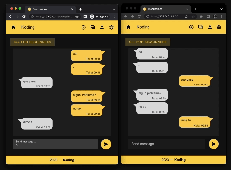

# Koding

Koding is a platform where anyone can view programming courses, and discuss about them with other people.

## Views

### Signup

### Login

### Home

### Settings

### Browse

### Account

### Course

### Chapter

### Live chat

## Technologies used

It was built with a fully independent Vue frontend. It was then integrated with django. It uses ASGI with channels and daphne. Makes use of REST api to retrieve certain data and websockets are used for the live interaction.

## Future updates

The goal is to make everyone able to add their courses and tips, so it is like a social platform for coders. Your status will increment the more you contribute with comments, courses and tips for other people. A tasks and activity tracking for major productivity.

